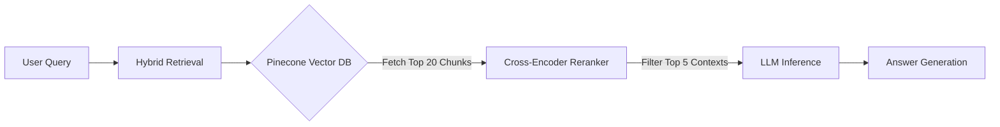

# NEXA AI Experience: RAG-Powered Knowledge Base 🚗

A high-performance, terminal-based Retrieval-Augmented Generation (RAG) system for Maruti Suzuki NEXA vehicle manuals. This project implements a **Hybrid Search Architecture** to deliver precise technical answers from complex PDF documentation, specifically optimized for tabular data (e.g., tyre pressures, maintenance schedules).

   

## 🏗 System Architecture

This project solves the "Retrieval Fragmentation" problem common in RAG systems by using a two-stage filtering process.



### The Pipeline
1.  **Ingestion Engine (`ingest.py`):**
    * Uses **Docling** with **RapidOCR** for layout-aware parsing.
    * Converts PDFs to semantic Markdown, preserving table structures (critical for technical specs).
2.  **Indexing (`index.py`):**
    * **Adaptive Chunking:** Implements a hybrid strategy (Semantic Splitting + Recursive Fallback) to handle large context windows without exceeding Pinecone's 40KB metadata limit.
    * **Embeddings:** Uses `BAAI/bge-small-en-v1.5` (SOTA open-source model).
3.  **Inference Engine (`chat.py`):**
    * **Retrieval:** Fetches a wide net (20 chunks) to ensure tables aren't missed.
    * **Reranking:** Uses `ms-marco-MiniLM-L-6-v2` to grade relevance and filter noise.
    * **Generation:** Powered by **OpenAI GPT-OSS-20B** (via Groq) for sub-second latency and strong reasoning capabilities.

## 🚀 Key Features

* **Multi-Model Support:** Unified knowledge base for Jimny, Grand Vitara, Fronx, and Baleno.
* **Table-Aware Inference:** Accurately extracts data from complex Markdown tables (e.g., "Full Load" vs. "Normal Load" tyre pressures).
* **Safety Protocol:** System prompt engineered to prioritize "WARNING" and "CAUTION" blocks.
* **Zero-Latency CLI:** Optimized for terminal usage with streaming responses.

## 📦 Installation & Setup

1.  **Clone the Repository**
    ```bash
    git clone https://github.com/yourusername/NexaMs-RAG-System.git
    cd NexaMs-RAG-System
    ```

2.  **Install Dependencies**
    ```bash
    pip install -r requirements.txt
    ```

3.  **Configure Environment**
    Create a `.env` file in the root directory:
    ```env
    PINECONE_API_KEY=your_pinecone_key
    GROQ_API_KEY=your_groq_key
    ```

4.  **Ingest Data (Optional)**
    Place PDFs in `data/raw_pdfs/` and run:
    ```bash
    python ingest.py
    python index.py
    ```

5.  **Run the Engine**
    ```bash
    python chat.py
    ```

## 👨‍💻 Tech Stack

* **Orchestration:** LlamaIndex
* **LLM:** OpenAI GPT-OSS-20B (Groq)
* **Embeddings:** BAAI/bge-small-en-v1.5
* **Reranker:** sentence-transformers (cross-encoder)
* **Vector Database:** Pinecone (Serverless)
* **OCR:** Docling + RapidOCR

---

